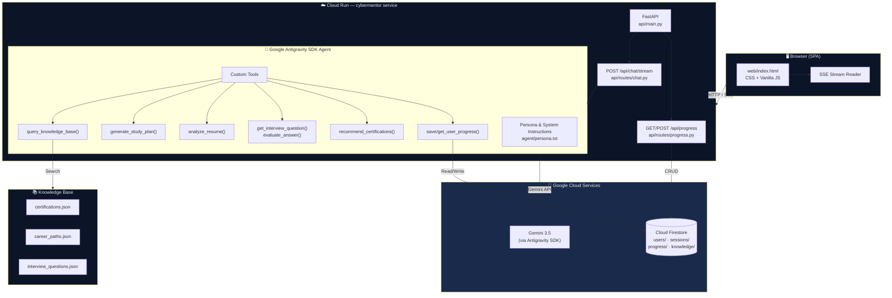

# CyberMentor — Architecture

## System Architecture



## Data Model

### Firestore Collections

```
users/{user_id}
├── profile: {
│     career_goal: string
│     experience_level: string
│     target_certs: string[]
│     created_at: ISO timestamp
│     updated_at: ISO timestamp
│   }
└── progress/{milestone_id}
      ├── milestone: string
      ├── notes: string
      └── timestamp: ISO timestamp

sessions/{session_id}
└── messages/{message_id}
      ├── role: "user" | "agent"
      ├── content: string
      └── timestamp: ISO timestamp
```

## Request Flow: Streaming Chat

```
User types message
      │
      ▼
POST /api/chat/stream
      │
      ├─ Lookup or create session_id
      │
      ├─ Prepend user context to message
      │
      ├─ async with create_cybermentor_agent(conversation_id) as agent:
      │       response = await agent.chat(message)
      │
      ├─ Stream SSE chunks → Browser
      │       data: {"token": "...", "session_id": "..."}
      │
      └─ data: {"done": true}
            │
            ▼
      Browser renders markdown
      Progress sidebar reloads
```

## Agent Tool Decision Tree

```
User message arrives
       │
       ├─ Contains cert name?           → query_knowledge_base() + generate_study_plan()
       ├─ Asks "what cert should I get?" → recommend_certifications()
       ├─ Pastes resume text?            → analyze_resume()
       ├─ Asks for interview question?   → get_interview_question()
       ├─ Answers an interview question? → evaluate_answer()
       ├─ Shares a milestone/progress?   → save_user_progress()
       └─ New session?                   → get_user_progress() (called at session start)
```

## Deployment

| Component | Service | Config |
|---|---|---|
| Backend | Cloud Run | 1 CPU, 1GB RAM, 0-10 instances |
| Database | Cloud Firestore | Enterprise edition, us-central1 |
| AI Model | Gemini 3.5 via AGY SDK | Default model |
| Frontend | Served from Cloud Run | Static files at `/static` |
| Secrets | Cloud Secret Manager | `cybermentor-gemini-key` |
